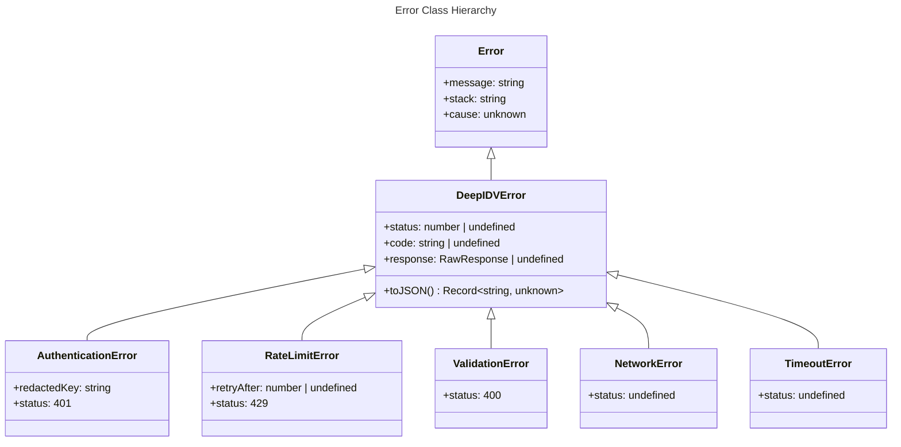
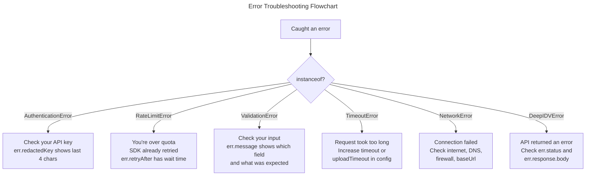

# Error Handling

Every error thrown by the SDK is an instance of `DeepIDVError` or one of its subclasses. No untyped exceptions escape the public API.

## Error Hierarchy



## Error Reference

### `DeepIDVError` (base class)

The base class for all SDK errors. Carries HTTP context when available.

| Field | Type | Description |
|-------|------|-------------|
| `message` | `string` | Human-readable error description |
| `status` | `number \| undefined` | HTTP status code (undefined for network/timeout errors) |
| `code` | `string \| undefined` | Machine-readable error code from the API |
| `response` | `RawResponse \| undefined` | Raw HTTP response with `status`, `headers`, and `body` |
| `cause` | `unknown` | Original error that triggered this one (Error.cause chain) |

### `AuthenticationError`

Thrown on HTTP 401. Your API key is invalid, expired, or missing.

| Field | Type | Description |
|-------|------|-------------|
| `redactedKey` | `string` | API key with only the last 4 characters visible (e.g., `"****abcd"`) |

```typescript
try {
  await client.document.scan({ image: buffer });
} catch (err) {
  if (err instanceof AuthenticationError) {
    console.error(`Invalid API key: ${err.redactedKey}`);
    // "Invalid API key: ****abcd"
  }
}
```

### `RateLimitError`

Thrown on HTTP 429 **after all retries are exhausted**. The SDK already retried with exponential backoff — you've hit a sustained rate limit.

| Field | Type | Description |
|-------|------|-------------|
| `retryAfter` | `number \| undefined` | Seconds to wait before retrying (from `Retry-After` header) |

```typescript
try {
  await client.face.detect({ image: buffer });
} catch (err) {
  if (err instanceof RateLimitError) {
    console.error(`Rate limited. Retry after ${err.retryAfter}s`);
  }
}
```

### `ValidationError`

Thrown on HTTP 400, or **before any network call** when input fails Zod schema validation.

```typescript
try {
  // Missing required 'image' field
  await client.document.scan({} as any);
} catch (err) {
  if (err instanceof ValidationError) {
    console.error(err.message);
    // "Required at 'image'"
  }
}
```

### `NetworkError`

Thrown on DNS failures, connection refused, socket hangup, or other network-level errors.

```typescript
try {
  await client.sessions.create(input);
} catch (err) {
  if (err instanceof NetworkError) {
    console.error('Network issue:', err.message);
    // Check internet connection, DNS, firewall
  }
}
```

### `TimeoutError`

Thrown when a single attempt exceeds the configured `timeout` (API requests) or `uploadTimeout` (S3 uploads).

```typescript
try {
  await client.identity.verify({ documentImage, faceImage });
} catch (err) {
  if (err instanceof TimeoutError) {
    console.error('Request timed out:', err.message);
    // Consider increasing timeout or uploadTimeout
  }
}
```

## Error Decision Tree



## Error.cause Chaining

All SDK errors preserve the original cause via the standard `Error.cause` property:

```typescript
try {
  await client.document.scan({ image: buffer });
} catch (err) {
  if (err instanceof DeepIDVError) {
    console.error('SDK error:', err.message);
    console.error('Caused by:', err.cause); // Original fetch error, ZodError, etc.
  }
}
```

This is useful for debugging — the `cause` chain shows exactly what went wrong at each layer.

## Structured Logging with `toJSON()`

Every `DeepIDVError` implements `toJSON()` for structured logging:

```typescript
try {
  await client.sessions.retrieve('invalid-id');
} catch (err) {
  if (err instanceof DeepIDVError) {
    console.log(JSON.stringify(err));
    // {
    //   "type": "DeepIDVError",
    //   "message": "Not Found",
    //   "status": 404,
    //   "code": "not_found"
    // }
  }
}
```

### API Key Redaction

`AuthenticationError.toJSON()` includes `redactedKey` instead of the full API key. The full key is **never** serialized — safe for logging, error tracking, and Sentry/Datadog:

```typescript
JSON.stringify(authError);
// {
//   "type": "AuthenticationError",
//   "message": "Invalid API key",
//   "status": 401,
//   "redactedKey": "****abcd"
// }
```

## try/catch Pattern

Recommended pattern for handling SDK errors:

```typescript
import {
  DeepIDV,
  AuthenticationError,
  RateLimitError,
  ValidationError,
  NetworkError,
  TimeoutError,
  DeepIDVError,
} from '@deepidv/server';

try {
  const result = await client.document.scan({ image: buffer });
  console.log(result.fullName);
} catch (err) {
  if (err instanceof ValidationError) {
    // Bad input — fix your code
    console.error('Invalid input:', err.message);
  } else if (err instanceof AuthenticationError) {
    // Bad API key — check config
    console.error('Auth failed:', err.redactedKey);
  } else if (err instanceof RateLimitError) {
    // Over quota — back off
    console.error(`Rate limited, retry after ${err.retryAfter}s`);
  } else if (err instanceof TimeoutError) {
    // Too slow — retry or increase timeout
    console.error('Timed out');
  } else if (err instanceof NetworkError) {
    // Network issue — retry later
    console.error('Network error:', err.message);
  } else if (err instanceof DeepIDVError) {
    // Other API error
    console.error(`API error ${err.status}: ${err.message}`);
  } else {
    throw err; // Not from the SDK
  }
}
```
