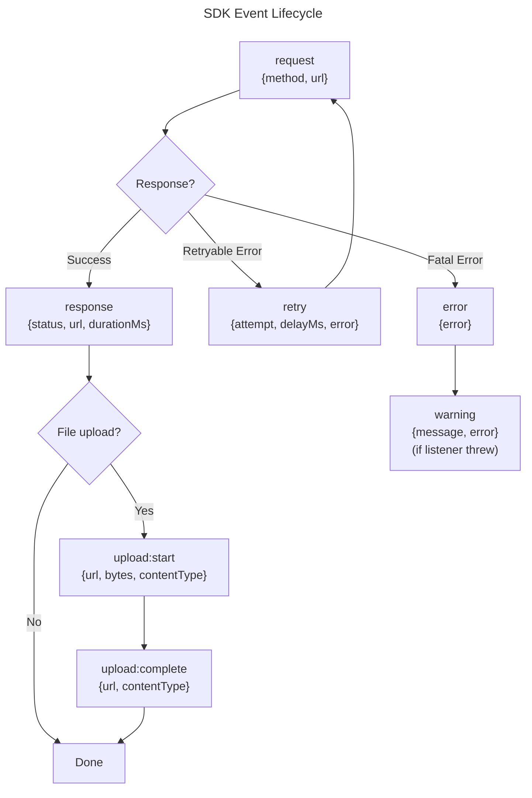

# Event System

The SDK emits lifecycle events for observability, logging, and APM integration. Events are fire-and-forget — they never block the return path or interfere with request processing.

## Event Lifecycle



## Event Reference

All events and their payload types from `SDKEventMap`:

### `request`

Fired before each HTTP request is sent to the API.

```typescript
client.on('request', ({ method, url }) => {
  console.log(`→ ${method} ${url}`);
});
```

| Field | Type | Description |
|-------|------|-------------|
| `method` | `string` | HTTP method (`GET`, `POST`, `PATCH`, etc.) |
| `url` | `string` | Full URL including base URL and path |

### `response`

Fired after each successful HTTP response is received.

```typescript
client.on('response', ({ status, url, durationMs }) => {
  console.log(`← ${status} ${url} (${durationMs}ms)`);
});
```

| Field | Type | Description |
|-------|------|-------------|
| `status` | `number` | HTTP status code |
| `url` | `string` | Full request URL |
| `durationMs` | `number` | Time from request start to response received |

### `retry`

Fired before each retry sleep. Gives you visibility into transient failures the SDK is handling automatically.

```typescript
client.on('retry', ({ attempt, delayMs, error }) => {
  console.warn(`Retry #${attempt} in ${delayMs}ms`, error);
});
```

| Field | Type | Description |
|-------|------|-------------|
| `attempt` | `number` | 1-based retry attempt number |
| `delayMs` | `number` | Milliseconds until next attempt |
| `error` | `unknown` | The error that triggered the retry |

### `error`

Fired when all retries are exhausted and the SDK is about to throw.

```typescript
client.on('error', ({ error }) => {
  // Send to Sentry, Datadog, etc.
  errorTracker.capture(error);
});
```

| Field | Type | Description |
|-------|------|-------------|
| `error` | `unknown` | The final error that will be thrown |

### `warning`

Fired when an event listener throws an exception. Listener errors are caught and re-emitted as warnings to prevent a broken listener from crashing the request.

```typescript
client.on('warning', ({ message, error }) => {
  console.warn('Listener error:', message, error);
});
```

| Field | Type | Description |
|-------|------|-------------|
| `message` | `string` | Description of what went wrong |
| `error` | `unknown` | The exception thrown by the listener |

### `upload:start`

Fired before each S3 PUT upload begins.

```typescript
client.on('upload:start', ({ url, bytes, contentType }) => {
  console.log(`Uploading ${bytes} bytes (${contentType})`);
});
```

| Field | Type | Description |
|-------|------|-------------|
| `url` | `string` | S3 presigned URL |
| `bytes` | `number` | File size in bytes |
| `contentType` | `string` | MIME type (e.g., `image/jpeg`) |

### `upload:complete`

Fired after each S3 PUT upload succeeds.

```typescript
client.on('upload:complete', ({ url, contentType }) => {
  console.log(`Upload complete (${contentType})`);
});
```

| Field | Type | Description |
|-------|------|-------------|
| `url` | `string` | S3 presigned URL |
| `contentType` | `string` | MIME type |

## Subscribing and Unsubscribing

`on()` returns an unsubscribe function — no need to keep a reference to the listener:

```typescript
// Subscribe
const unsub = client.on('request', ({ method, url }) => {
  console.log(`${method} ${url}`);
});

// Later: unsubscribe
unsub();
```

### One-Time Listeners

Use `once()` on the underlying emitter (not exposed on `DeepIDV` — use `on()` and manually unsubscribe for one-shot behavior):

```typescript
const unsub = client.on('response', (payload) => {
  console.log('First response:', payload.status);
  unsub(); // Remove after first fire
});
```

## Execution Model

Events are dispatched **synchronously** within the request flow:

1. The SDK calls `emitter.emit('request', payload)` synchronously
2. All registered listeners execute in registration order
3. After all listeners complete, the SDK continues with the request

This means:
- Listeners **should not** perform heavy blocking work (use async logging instead)
- Listeners **cannot** modify the request or response (they receive read-only payloads)
- The SDK **does not await** listener return values

## Listener Error Safety

If a listener throws, the SDK:

1. Catches the exception
2. Emits a `warning` event with the error details
3. Continues processing normally

If a `warning` listener itself throws, the exception is **silently swallowed** to prevent infinite recursion.

```typescript
// This broken listener won't crash your application:
client.on('request', () => {
  throw new Error('oops');
});

// The SDK catches it and emits:
// warning: { message: "Listener error in 'request'", error: Error('oops') }
```

## APM Integration Example

```typescript
import { DeepIDV } from '@deepidv/server';

const client = new DeepIDV({ apiKey: process.env.DEEPIDV_API_KEY! });

// Datadog APM
client.on('request', ({ method, url }) => {
  tracer.trace('deepidv.request', { resource: `${method} ${url}` });
});

client.on('response', ({ status, durationMs }) => {
  metrics.histogram('deepidv.latency', durationMs);
  metrics.increment('deepidv.requests', { status: String(status) });
});

client.on('retry', ({ attempt, delayMs }) => {
  metrics.increment('deepidv.retries', { attempt: String(attempt) });
});

client.on('error', ({ error }) => {
  errorTracker.captureException(error);
});
```
