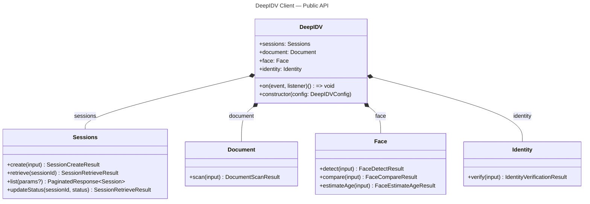
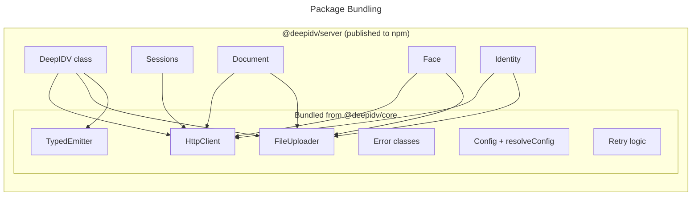

# Architecture Overview

The `@deepidv/server` SDK is a backend-first TypeScript library that wraps the [deepidv](https://api.deepidv.com) identity verification API. It runs on Node.js 18+, Deno, Bun, and Cloudflare Workers.

## Design Principles

**Thin client.** The SDK is a typed HTTP wrapper — it validates inputs, manages auth and retries, orchestrates file uploads, and returns structured results. All verification logic runs server-side at api.deepidv.com.

**Web-standards-first.** The SDK uses only native web APIs (`fetch`, `AbortController`, `ReadableStream`, `Uint8Array`, `crypto.subtle`). No Node-specific imports in the core package. This is what enables universal runtime support.

**Grouped modules.** Methods are organized by domain — `client.sessions`, `client.document`, `client.face`, `client.identity` — matching the API structure. This gives better autocomplete and discoverability than a flat API.

**Single dependency.** The only production dependency is [zod](https://zod.dev) for runtime input validation. Zod schemas are the single source of truth for both TypeScript types and runtime checks.

## Three Service Tiers

| Tier | Pattern | Examples |
|------|---------|----------|
| **Synchronous** | One call, one result. Image in, structured data out. | `document.scan()`, `face.detect()`, `face.compare()`, `face.estimateAge()` |
| **Orchestrated** | One call, multiple operations coordinated server-side. | `identity.verify()` (document scan + face detect + face compare) |
| **Session-based** | Create session, user completes steps, retrieve results. | `sessions.create()`, `sessions.retrieve()` |

## Public API Surface



The `DeepIDV` class is the only public entry point. The module classes (`Sessions`, `Document`, `Face`, `Identity`) are **not exported** — consumers access them exclusively through the client instance.

## Core Internals

Under the hood, `@deepidv/core` provides the shared infrastructure that all modules depend on:

```mermaid
---
title: "@deepidv/core — Internal Infrastructure"
---
classDiagram
    class HttpClient {
        +request~T~(method, path, options?) T
        +get~T~(path, options?) T
        +post~T~(path, body, options?) T
        +patch~T~(path, body, options?) T
        +put~T~(path, body, options?) T
        +delete~T~(path, options?) T
    }

    class FileUploader {
        +upload(inputs, options?) string[]
    }

    class TypedEmitter {
        +on(event, listener) () => void
        +once(event, listener) () => void
        +emit(event, payload) void
    }

    class DeepIDVError {
        +status: number?
        +code: string?
        +response: RawResponse?
        +toJSON() Record
    }

    class AuthenticationError {
        +redactedKey: string
    }

    class RateLimitError {
        +retryAfter: number?
    }

    class ValidationError
    class NetworkError
    class TimeoutError

    HttpClient --> TypedEmitter : emits events
    HttpClient --> "withRetry()" : retry logic
    FileUploader --> HttpClient : presign requests
    FileUploader --> TypedEmitter : upload events

    DeepIDVError <|-- AuthenticationError
    DeepIDVError <|-- RateLimitError
    DeepIDVError <|-- ValidationError
    DeepIDVError <|-- NetworkError
    DeepIDVError <|-- TimeoutError
```

## Package Structure

`@deepidv/core` is **not published as a separate npm package**. It is bundled into `@deepidv/server` at build time via tsup's `noExternal` option. Consumers install one package:



This means:
- `npm install @deepidv/server` is the only install command
- No `workspace:*` protocol resolution issues
- No peer dependency on `@deepidv/core`
- Consumer's bundler doesn't need to resolve monorepo internals

## What the SDK Does NOT Do

| Excluded | Reason |
|----------|--------|
| AWS SDK dependency | All S3 interaction uses presigned URLs via native `fetch` |
| UI components | This is a server SDK. See `@deepidv/web` (future) |
| Image processing | No resizing, conversion, or format detection beyond magic-byte MIME sniffing |
| Logging to stdout | Uses a typed event emitter — the consumer decides what to log |
| Polling or webhooks | v1 services are synchronous; session-based polling is deferred |
| Error swallowing | Always throws typed errors; never returns `null` for failure |
| Retry on 4xx | 4xx errors are caller bugs, not transient failures. Only 429 and 5xx are retried |
| Mutable singletons | Each `new DeepIDV()` is independent; constructor is cheap |

## Dependency Injection

The `DeepIDV` constructor wires all dependencies eagerly:

1. Validates config with `DeepIDVConfigSchema` (Zod)
2. Resolves defaults via `resolveConfig()`
3. Creates a `TypedEmitter` instance
4. Creates an `HttpClient` with the resolved config and emitter
5. Creates a `FileUploader` with the config, HTTP client, and emitter
6. Instantiates `Sessions(httpClient)`, `Document(httpClient, uploader)`, `Face(httpClient, uploader)`, `Identity(httpClient, uploader)`

No lazy loading, no service locator, no global state.
