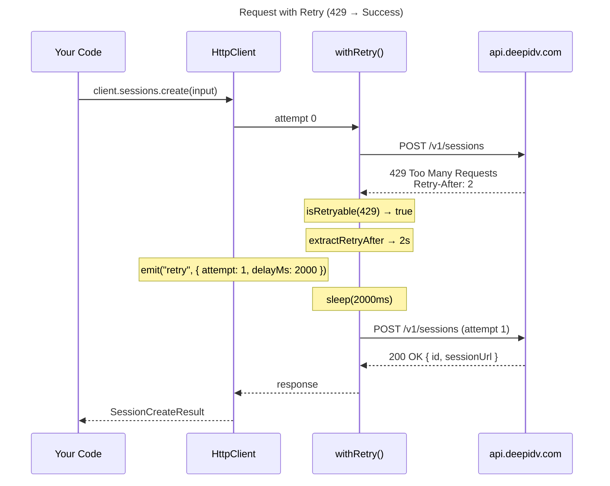
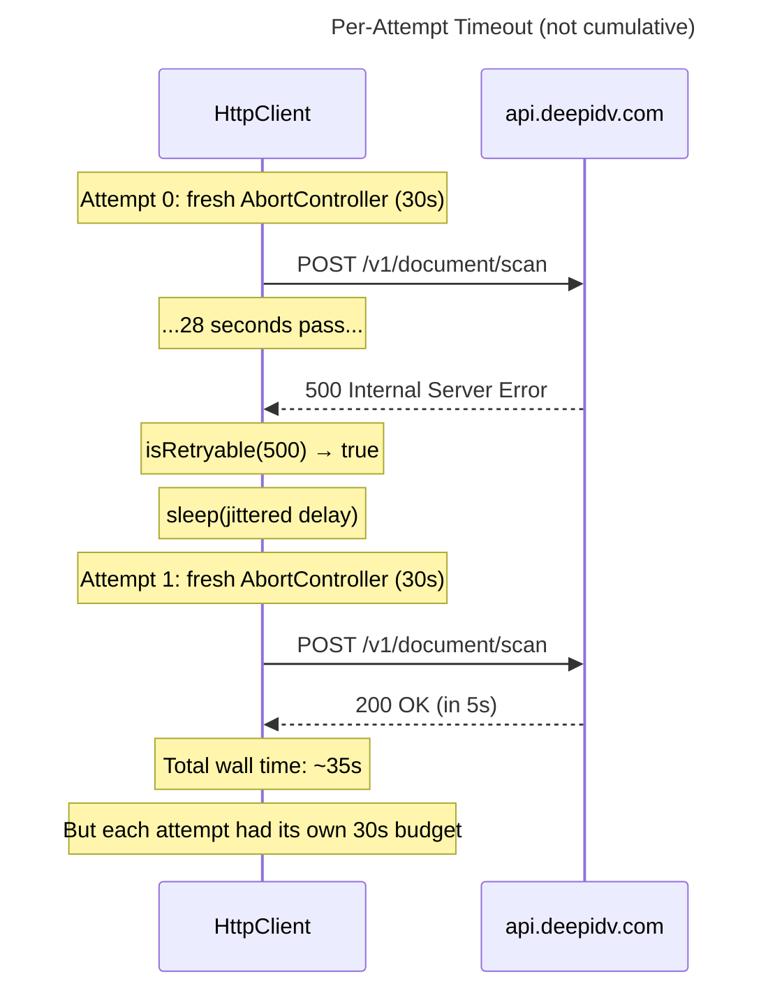

# Retry & Timeout Behavior

The SDK automatically retries failed requests using exponential backoff with jitter. This document explains exactly when, how, and how long the SDK retries.

## When Retries Happen

| Condition | Retried? | Reason |
|-----------|----------|--------|
| HTTP 429 (Too Many Requests) | Yes | Transient rate limit — back off and try again |
| HTTP 5xx (Server Error) | Yes | Server-side transient failure |
| `NetworkError` | Yes | Connection dropped, DNS failure — may recover |
| `TimeoutError` | Yes | Single attempt timed out — next attempt gets a fresh timer |
| HTTP 400 (Bad Request) | **No** | Client error — retrying won't help |
| HTTP 401 (Unauthorized) | **No** | Invalid API key — retrying won't help |
| HTTP 403 (Forbidden) | **No** | Permission denied — retrying won't help |
| HTTP 404 (Not Found) | **No** | Resource doesn't exist — retrying won't help |
| Any other 4xx | **No** | Client errors are never retried |

## Retry Flow



## Exponential Backoff with Jitter

When no `Retry-After` header is present, delay is calculated using **full jitter**:

```
delay = random(0, min(initialDelay * 2^attempt, MAX_BACKOFF))
```

Where:
- `initialDelay` = 500ms (configurable via `initialRetryDelay`)
- `MAX_BACKOFF` = 30,000ms (30 seconds, not configurable)
- `attempt` = 0-based retry index (0 = first retry)

| Retry # | Attempt | Base Delay | Max Jittered Delay |
|---------|---------|------------|-------------------|
| 1st retry | 0 | 500ms | 0–500ms |
| 2nd retry | 1 | 1,000ms | 0–1,000ms |
| 3rd retry | 2 | 2,000ms | 0–2,000ms |
| 4th retry | 3 | 4,000ms | 0–4,000ms |
| ... | n | 500 * 2^n | 0–min(500 * 2^n, 30,000)ms |

The jitter ensures multiple clients hitting rate limits don't all retry at the same instant (thundering herd).

## Retry-After Header

When the API returns a `Retry-After` header, it takes priority over exponential backoff:

- **Numeric value** (e.g., `Retry-After: 5`): wait 5 seconds
- **HTTP date** (e.g., `Retry-After: Mon, 07 Apr 2025 00:00:00 GMT`): wait until that time
- **Capped at 60 seconds**: any `Retry-After` value above 60s is clamped to 60s to prevent indefinite waits

## Per-Attempt Timeout

Timeouts are **per-attempt**, not cumulative. Each retry attempt gets a fresh `AbortController` with its own timer:



This means the maximum wall time for a request with default settings (3 retries, 30s timeout) could be up to ~120s in the worst case.

## Configuration

```typescript
const client = new DeepIDV({
  apiKey: 'your-key',

  // Per-attempt timeout for API requests (default: 30,000ms)
  timeout: 15_000,

  // Per-attempt timeout for S3 uploads (default: 120,000ms)
  uploadTimeout: 60_000,

  // Maximum retry attempts (default: 3)
  maxRetries: 5,

  // Initial delay for exponential backoff (default: 500ms)
  initialRetryDelay: 1_000,
});
```

### Disabling Retries

```typescript
const client = new DeepIDV({
  apiKey: 'your-key',
  maxRetries: 0, // No retries — fail immediately
});
```

## Retry Events

Before each retry sleep, the SDK emits a `retry` event:

```typescript
client.on('retry', ({ attempt, delayMs, error }) => {
  console.log(`Retry attempt ${attempt} in ${delayMs}ms`);
  console.log('Caused by:', error);
});
```

| Field | Type | Description |
|-------|------|-------------|
| `attempt` | `number` | 1-based retry attempt number |
| `delayMs` | `number` | Milliseconds the SDK will sleep before retrying |
| `error` | `unknown` | The error that triggered the retry |

## Two Timeout Zones

The SDK has two independent timeout configurations because API calls and S3 uploads have very different performance profiles:

```
┌─────────────────────────────────────────────────────────┐
│                   Full Upload Flow                      │
│                                                         │
│  ┌──────────────┐   ┌──────────────┐   ┌────────────┐  │
│  │  Presign API  │   │  S3 PUT      │   │ Process API │  │
│  │  (timeout)    │   │ (uploadTimeout)│  │  (timeout)  │  │
│  │  30s default  │   │ 120s default  │   │  30s default│  │
│  └──────────────┘   └──────────────┘   └────────────┘  │
└─────────────────────────────────────────────────────────┘
```

The upload timeout is separate and longer because:
- Document images can be several MB
- Upload speed depends on the user's bandwidth, not the API's response time
- A 30s timeout is too short for large files on slow connections
