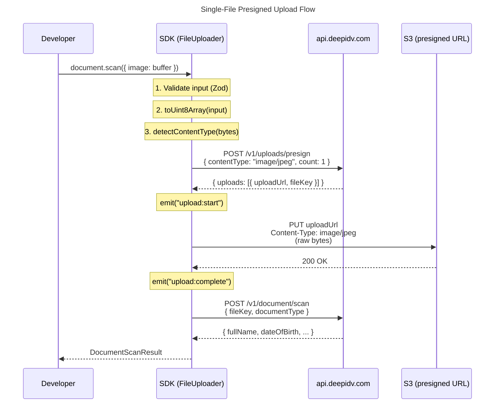
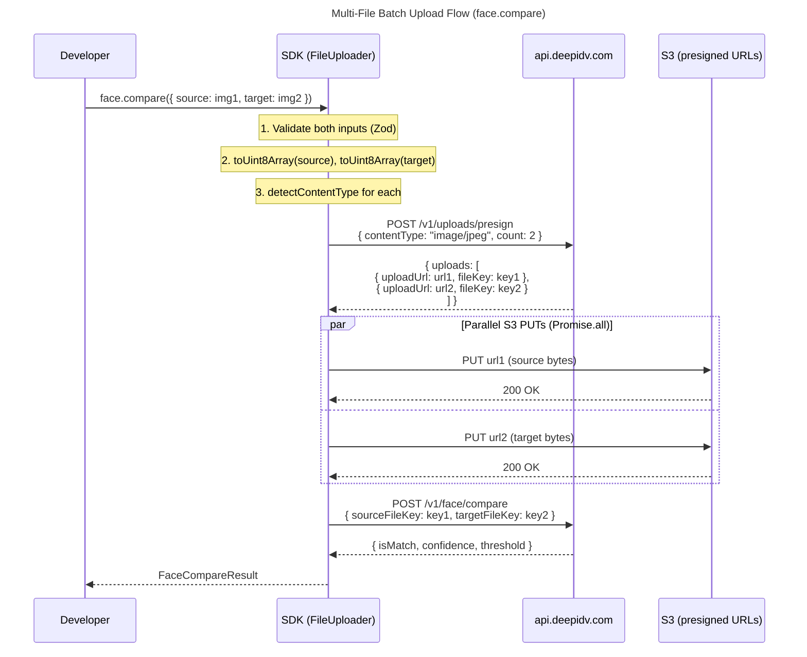

# Presigned Upload Flow

Every file-based operation in the SDK (document scan, face detection, face comparison, age estimation, identity verification) uses the same presigned URL upload flow. The developer passes an image — the SDK handles everything else.

## Single-File Upload

Used by `document.scan()`, `face.detect()`, and `face.estimateAge()`:



## Multi-File Upload (Batch)

Used by `face.compare()` (source + target) and `identity.verify()` (document + face):



Key difference: a **single** presign request with `count: 2` returns two upload slots. The S3 PUTs happen in parallel via `Promise.all`, making batch uploads faster than sequential.

## Accepted Input Types

The `FileInput` type accepts five formats. The `toUint8Array()` function normalizes all of them before upload:

| Input Type | Detection | Behavior |
|-----------|-----------|----------|
| `Uint8Array` | `instanceof Uint8Array` | Pass through unchanged. Node `Buffer` extends `Uint8Array`, so buffers work automatically. |
| `ReadableStream<Uint8Array>` | `instanceof ReadableStream` | Fully materialized to `Uint8Array` by reading all chunks. This happens **before** the retry loop to prevent double-read bugs (UPL-06). |
| Data URL string | Starts with `data:` | Base64 portion extracted and decoded to bytes. |
| Base64 string | `typeof string` + length > 256 + matches base64 pattern | Decoded to bytes via `atob()`. |
| File path string | `typeof string` (fallback) | Read from disk via `fs.readFile`. Only works on Node.js, Deno, and Bun — throws `ValidationError` on edge runtimes. |

```typescript
// All of these work:
await client.document.scan({ image: fs.readFileSync('id.jpg') });           // Buffer (Uint8Array)
await client.document.scan({ image: new Uint8Array([0xFF, 0xD8, ...]) });   // Uint8Array
await client.document.scan({ image: readableStream });                       // ReadableStream
await client.document.scan({ image: 'data:image/jpeg;base64,/9j/4A...' }); // Data URL
await client.document.scan({ image: '/path/to/id.jpg' });                   // File path (Node only)
```

## Content-Type Detection

The SDK detects image format from magic bytes — the first few bytes of the file:

| Format | Magic Bytes | MIME Type |
|--------|------------|-----------|
| JPEG | `FF D8 FF` | `image/jpeg` |
| PNG | `89 50 4E 47` | `image/png` |
| WebP | `52 49 46 46 ... 57 45 42 50` | `image/webp` |

If the bytes don't match any known format, a `ValidationError` is thrown before any network call.

You can override detection by passing `contentType` in upload options (used internally by module methods).

## Timeout Configuration

Two independent timeouts control different parts of the flow:

| Config | Default | Controls |
|--------|---------|----------|
| `timeout` | 30,000ms (30s) | Per-attempt timeout for API requests (presign, processing endpoints) |
| `uploadTimeout` | 120,000ms (2min) | Per-attempt timeout for S3 PUT uploads |

The upload timeout is longer because file uploads can be significantly larger than API request/response payloads.

```typescript
const client = new DeepIDV({
  apiKey: 'your-key',
  timeout: 15_000,       // 15s for API calls
  uploadTimeout: 60_000, // 60s for uploads
});
```

## S3 PUT Behavior

S3 PUTs use the raw `fetch` implementation from config — **not** the `HttpClient`. This means:

- **No `x-api-key` header** is sent to S3 (the presigned URL contains its own auth)
- **No retry via `withRetry()`** — S3 PUTs have their own error handling:
  - `403 Forbidden` → presigned URL expired → throws `DeepIDVError` with code `upload_url_expired`
  - `5xx` or network error → retried by the outer `withRetry()` wrapping the entire upload flow
  - Timeout → throws `TimeoutError` using `uploadTimeout`

## Upload Events

The event emitter fires two events during uploads:

| Event | Payload | When |
|-------|---------|------|
| `upload:start` | `{ url, bytes, contentType }` | Before each S3 PUT |
| `upload:complete` | `{ url, contentType }` | After each successful S3 PUT |

For batch uploads, you'll receive one `upload:start` and one `upload:complete` per file.
