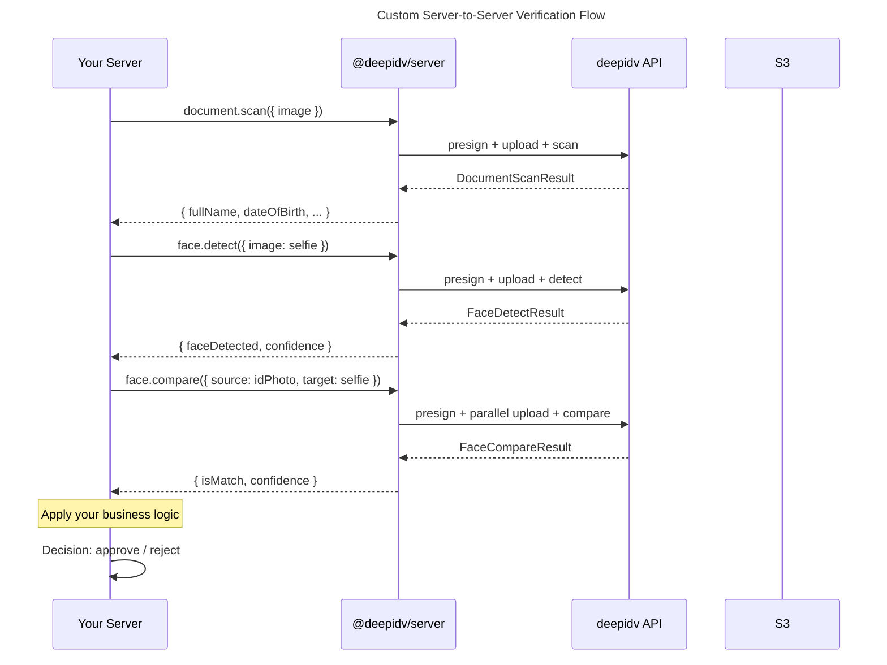

# Server-to-Server Verification Guide

Use the SDK's primitive methods to build your own verification flow — scan documents, detect faces, compare images, and estimate ages with full control over the pipeline.

## When to Use This vs. Hosted Sessions

| Use Case | Approach |
|----------|----------|
| Standard KYC onboarding | Hosted sessions — easier, includes UI |
| Custom verification UX | Server-to-server — full control |
| Batch document processing | Server-to-server — no user interaction |
| Backend automation / screening | Server-to-server — programmatic |
| Quick integration, minimal code | Hosted sessions |

## Flow Overview



## Document Scan

Extract structured OCR data from an identity document:

```typescript
import { readFileSync } from 'fs';

const result = await client.document.scan({
  image: readFileSync('passport.jpg'),
  documentType: 'passport', // 'passport' | 'drivers_license' | 'national_id' | 'auto'
});
```

The `documentType` defaults to `'auto'` — the API will detect the document type. Specifying it can improve accuracy.

### DocumentScanResult Fields

| Field | Type | Description |
|-------|------|-------------|
| `documentType` | `string` | Detected document type |
| `fullName` | `string` | Full name as printed on the document |
| `firstName` | `string` | First / given name |
| `lastName` | `string` | Last / family name |
| `dateOfBirth` | `string` | Date of birth |
| `gender` | `string` | Gender |
| `nationality` | `string` | Nationality |
| `documentNumber` | `string` | Document number / ID number |
| `expirationDate` | `string` | Document expiration date |
| `issuingCountry` | `string` | Country that issued the document |
| `address` | `string?` | Address (if present on document) |
| `mrzData` | `string?` | Machine-readable zone data |
| `faceImage` | `string?` | Extracted face image (base64) |
| `rawFields` | `Record<string, string>` | All extracted key-value pairs |
| `confidence` | `number` | Overall OCR confidence (0–1) |

## Face Detection

Detect a face in an image and get confidence, bounding box, and landmarks:

```typescript
const result = await client.face.detect({
  image: readFileSync('selfie.jpg'),
});

if (result.faceDetected) {
  console.log(`Face confidence: ${result.confidence}`);

  if (result.boundingBox) {
    const { top, left, width, height } = result.boundingBox;
    console.log(`Face at (${left}, ${top}) — ${width}x${height}`);
  }

  if (result.landmarks) {
    for (const lm of result.landmarks) {
      console.log(`${lm.type}: (${lm.x}, ${lm.y})`);
    }
  }
}
```

### FaceDetectResult Fields

| Field | Type | Description |
|-------|------|-------------|
| `faceDetected` | `boolean` | Whether a face was found |
| `confidence` | `number` | Detection confidence (0–1) |
| `boundingBox` | `{ top, left, width, height }?` | Face bounding box coordinates |
| `landmarks` | `Array<{ type, x, y }>?` | Facial landmark positions |

## Face Comparison

Compare two face images to check if they're the same person. Both images are uploaded in parallel for speed:

```typescript
const result = await client.face.compare({
  source: readFileSync('id-photo.jpg'),
  target: readFileSync('selfie.jpg'),
});

if (result.isMatch) {
  console.log(`Match! Confidence: ${result.confidence}`);
} else {
  console.log(`No match. Confidence: ${result.confidence}, threshold: ${result.threshold}`);
}
```

### FaceCompareResult Fields

| Field | Type | Description |
|-------|------|-------------|
| `isMatch` | `boolean` | Whether the faces match (confidence >= threshold) |
| `confidence` | `number` | Match confidence (0–1) |
| `threshold` | `number` | Minimum confidence for a match |
| `sourceFaceDetected` | `boolean` | Face found in source image |
| `targetFaceDetected` | `boolean` | Face found in target image |

## Age Estimation

Estimate age and gender from a face image:

```typescript
const result = await client.face.estimateAge({
  image: readFileSync('selfie.jpg'),
});

console.log(`Estimated age: ${result.estimatedAge}`);
console.log(`Age range: ${result.ageRange.low}–${result.ageRange.high}`);
console.log(`Gender: ${result.gender} (${result.genderConfidence})`);
```

### FaceEstimateAgeResult Fields

| Field | Type | Description |
|-------|------|-------------|
| `estimatedAge` | `number` | Best-estimate age |
| `ageRange` | `{ low: number, high: number }` | Confidence range |
| `gender` | `'male' \| 'female'` | Estimated gender |
| `genderConfidence` | `number` | Gender estimation confidence (0–1) |
| `faceDetected` | `boolean` | Whether a face was found |

## Identity Verification (Shortcut)

`identity.verify()` combines document scan + face detection + face comparison into a single call. The SDK uploads both images in parallel:

```typescript
const result = await client.identity.verify({
  documentImage: readFileSync('passport.jpg'),
  faceImage: readFileSync('selfie.jpg'),
  documentType: 'passport', // optional, defaults to auto-detect
});

console.log(result.verified);           // true/false
console.log(result.overallConfidence);  // 0.96

// Document data
console.log(result.document.fullName);
console.log(result.document.dateOfBirth);

// Face detection
console.log(result.faceDetection.faceDetected);
console.log(result.faceDetection.confidence);

// Face match
console.log(result.faceMatch.isMatch);
console.log(result.faceMatch.confidence);
```

### IdentityVerificationResult Fields

| Field | Type | Description |
|-------|------|-------------|
| `verified` | `boolean` | Overall pass/fail |
| `overallConfidence` | `number` | Aggregate confidence (0–1) |
| `document` | `IdentityDocumentResult` | OCR data from the document |
| `faceDetection` | `IdentityFaceDetectionResult` | Face detection from the selfie |
| `faceMatch` | `IdentityFaceMatchResult` | Face comparison result |

All three sub-results are always present on a 2xx response, even if `verified` is `false`.

## Building a Custom Pipeline

Combine primitives with your own business logic:

```typescript
async function verifyCustomer(idImage: Buffer, selfie: Buffer) {
  // 1. Scan the document
  const doc = await client.document.scan({ image: idImage });

  // 2. Check document validity
  if (doc.confidence < 0.8) {
    return { approved: false, reason: 'Low document quality' };
  }

  // Check expiration
  const expiry = new Date(doc.expirationDate);
  if (expiry < new Date()) {
    return { approved: false, reason: 'Document expired' };
  }

  // 3. Compare faces
  const match = await client.face.compare({
    source: idImage,
    target: selfie,
  });

  if (!match.isMatch) {
    return { approved: false, reason: 'Face mismatch' };
  }

  // 4. Age check (optional)
  const age = await client.face.estimateAge({ image: selfie });
  if (age.estimatedAge < 18) {
    return { approved: false, reason: 'Under 18' };
  }

  return {
    approved: true,
    name: doc.fullName,
    documentNumber: doc.documentNumber,
    faceConfidence: match.confidence,
  };
}
```
