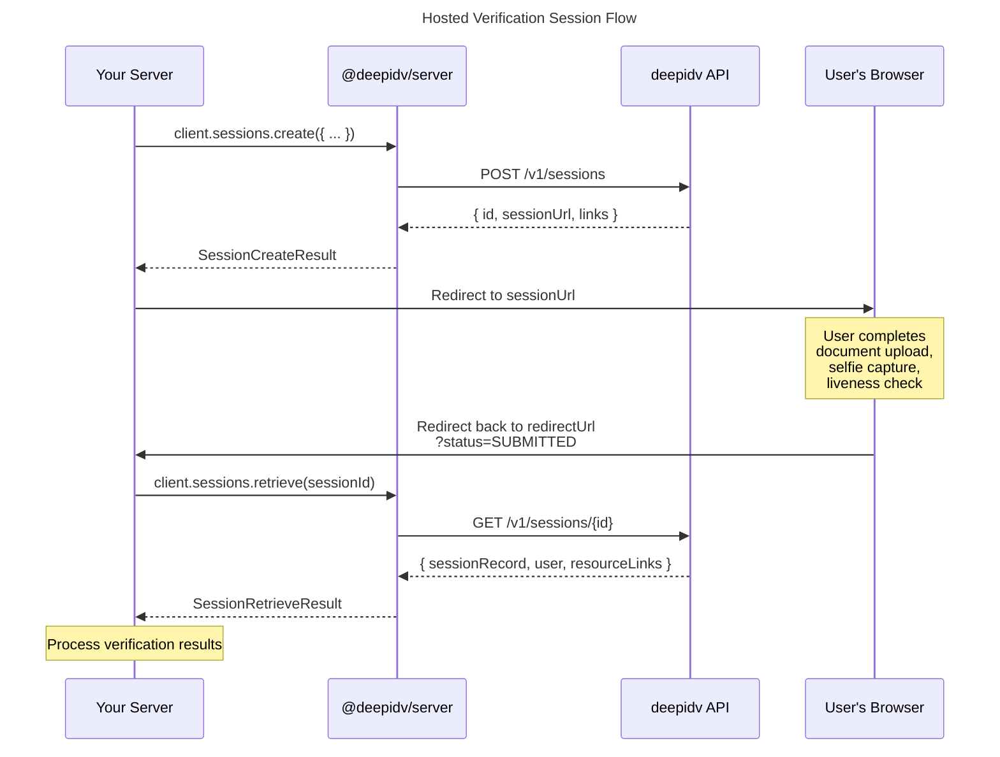

# Session-Based Verification Guide

Hosted sessions are the easiest way to verify identities. You create a session, send the user to a hosted verification page, and retrieve the results when they're done.

## Flow Overview



## Step 1: Create a Session

```typescript
const session = await client.sessions.create({
  // Required fields
  firstName: 'Jane',
  lastName: 'Doe',
  email: 'jane@example.com',
  phone: '+15551234567',

  // Optional: redirect user back to your app when done
  redirectUrl: 'https://yourapp.com/verification-complete',

  // Optional: your internal reference ID
  externalId: 'user_abc123',

  // Optional: trigger email/SMS invitations
  sendEmailInvite: true,
  sendPhoneInvite: false,

  // Optional: use a specific workflow
  workflowId: 'wf_standard_kyc',
});
```

### Session Create Result

| Field | Type | Description |
|-------|------|-------------|
| `id` | `string` | Unique session identifier |
| `sessionUrl` | `string` | URL to send the user to for verification |
| `externalId` | `string?` | Your external reference ID (if provided) |
| `links` | `Array<{ url, type }>` | Associated resource links |

## Step 2: Send the User to Verify

Redirect the user to `session.sessionUrl`. They'll see the deepidv hosted verification page where they can:

1. Upload their identity document (passport, driver's license, national ID)
2. Take a selfie for face matching
3. Complete liveness detection

## Step 3: Handle the Callback

When the user finishes (or abandons), they're redirected to your `redirectUrl` with query parameters:

```
https://yourapp.com/verification-complete?status=SUBMITTED&sessionId=abc123
```

## Step 4: Retrieve Results

```typescript
const result = await client.sessions.retrieve(session.id);

const record = result.sessionRecord;
console.log(record.status);           // "SUBMITTED"
console.log(record.sessionProgress);  // "COMPLETED"
```

### Navigating Analysis Data

The `analysisData` field contains all verification results:

```typescript
const analysis = record.analysisData;

if (analysis) {
  // Face match between ID and selfie
  console.log(analysis.idMatchesSelfie);      // true/false
  console.log(analysis.facelivenessScore);     // 0.99

  // Document OCR data
  const idData = analysis.idAnalysisData;
  if (idData) {
    // Extracted text fields
    for (const field of idData.idExtractedText) {
      console.log(`${field.type}: ${field.value} (${field.confidence})`);
    }

    // Compliance checks
    console.log(idData.expiryDatePass);       // true = not expired
    console.log(idData.validStatePass);       // true = valid jurisdiction
    console.log(idData.ageRestrictionPass);   // true = meets age requirement
  }

  // Face comparison details
  const compare = analysis.compareFacesData;
  if (compare) {
    console.log(compare.faceMatchConfidence); // 0.94
  }
}
```

### Resource Links

Presigned URLs for accessing uploaded documents and images:

```typescript
if (result.resourceLinks) {
  for (const [name, url] of Object.entries(result.resourceLinks)) {
    console.log(`${name}: ${url}`);
    // "id_front: https://s3.amazonaws.com/..."
    // "selfie: https://s3.amazonaws.com/..."
  }
}
```

## Step 5: Update Session Status

After reviewing the results, update the session status:

```typescript
// Approve the verification
await client.sessions.updateStatus(session.id, 'VERIFIED');

// Or reject it
await client.sessions.updateStatus(session.id, 'REJECTED');

// Or void it (e.g., duplicate submission)
await client.sessions.updateStatus(session.id, 'VOIDED');
```

Valid status updates: `VERIFIED`, `REJECTED`, `VOIDED`.

You cannot set `PENDING` or `SUBMITTED` — those are managed by the API based on user activity.

## Listing Sessions

```typescript
// List all sessions
const page = await client.sessions.list();
console.log(`Found ${page.data.length} sessions`);

// Filter by status
const verified = await client.sessions.list({
  status: 'VERIFIED',
  limit: 10,
  offset: 0,
});

for (const session of verified.data) {
  console.log(`${session.id}: ${session.status} (${session.createdAt})`);
}
```

### Pagination

```typescript
let offset = 0;
const limit = 25;

while (true) {
  const page = await client.sessions.list({ limit, offset });

  for (const session of page.data) {
    processSession(session);
  }

  if (!page.hasMore || page.data.length < limit) break;
  offset += limit;
}
```

### PaginatedResponse Fields

| Field | Type | Description |
|-------|------|-------------|
| `data` | `Session[]` | Array of session records |
| `total` | `number?` | Total number of matching sessions |
| `hasMore` | `boolean?` | Whether more pages exist |
| `limit` | `number` | Page size used |
| `offset` | `number` | Starting offset |

## Session Statuses

| Status | Meaning | Set By |
|--------|---------|--------|
| `PENDING` | Session created, user hasn't started | API |
| `SUBMITTED` | User completed the verification flow | API |
| `VERIFIED` | Approved by your team | You (via `updateStatus`) |
| `REJECTED` | Rejected by your team | You (via `updateStatus`) |
| `VOIDED` | Cancelled / invalidated | You (via `updateStatus`) |
